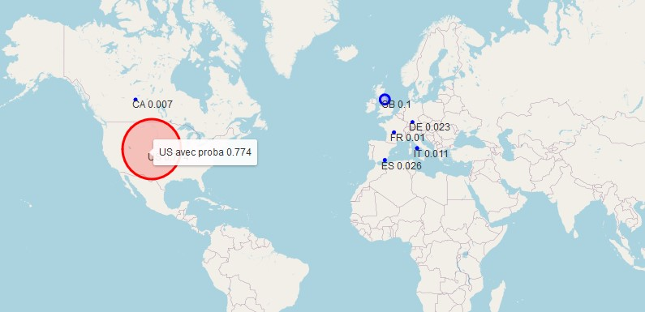

# BookerGuess
Where will you book your first travel experience ? - Airbnb New User Bookings dataset

Cette étude a fait l'objet d'un devoir pour le cours de Projet ML/Data Science 
à l'Université Paris-Dauphine et reprend le défi lancé par Airbnb en 2016.
Le problème posé se résume à établir des suggestions de destinations pour 
des utilisateurs nouvellement inscrits sur la plateforme Airbnb. 

Le but de ce projet est de fournir des analyses pertinentes sur les données 
des utilisateurs afin de prédire leur comportement (vont-ils réserver ?, quelle destination ?).
Dans le cadre du devoir, la contrainte est **d'implémenter au maximum tout 
algorithme de Machine Learning et d'analyse soi-même** (Kmeans, RandomForest, PCA...).
 
# Dépendances

Les bibliothèques Python utilisées : 

* Numpy
* Pandas
* Folium
* gensim
* JupyterLab (éventuellement)
```
pip install numpy pandas folium gensim
```

# Réalisations

* Analyses univariées et bivariées sur des variables quantitatives et qualitatives,
* Embeddings de séquences d'actions / historiques des utilisateurs,
* Extraction d'actions récurrentes ,
* Implémentations d'arbres de décisions et méthodes d'ensemble,
* Clustering du comportement des utilisateurs,
* Undersampling et gestion du problème de classes déséquilibrées,
* Visualisation des destinations suggérées aux utilisateurs sur une carte.

<br>




